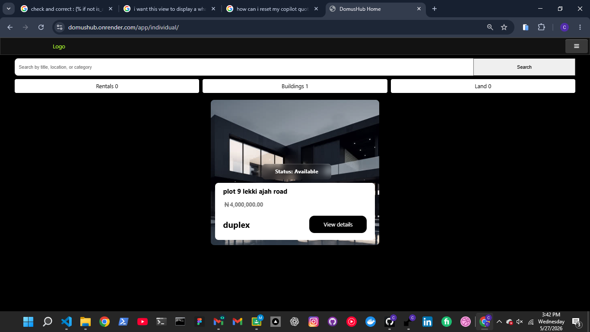
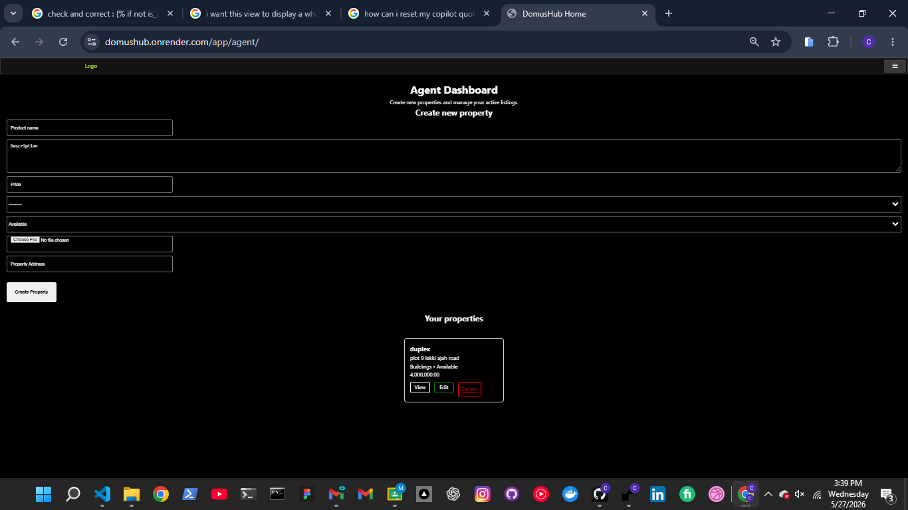
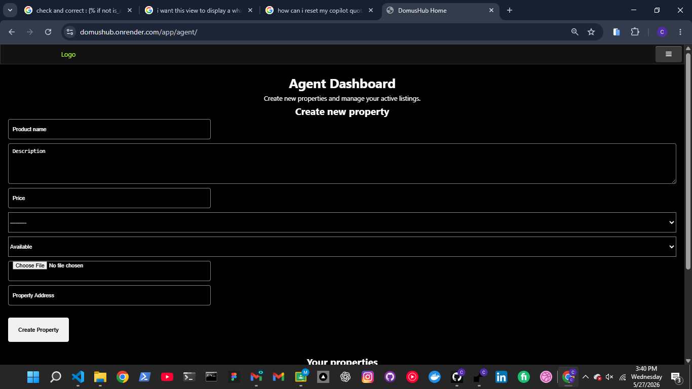
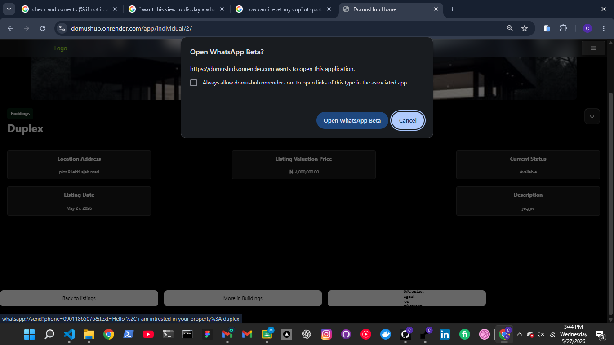
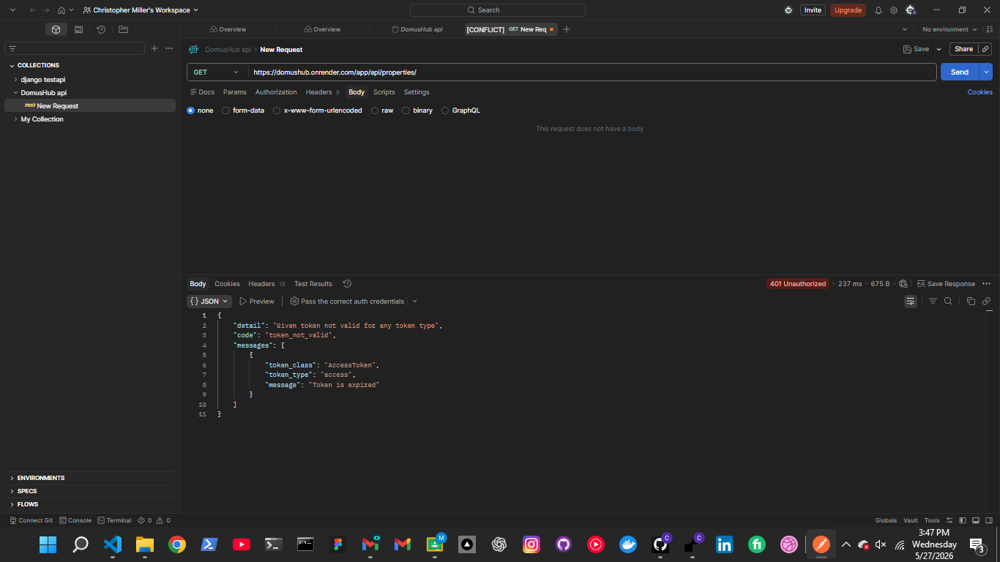
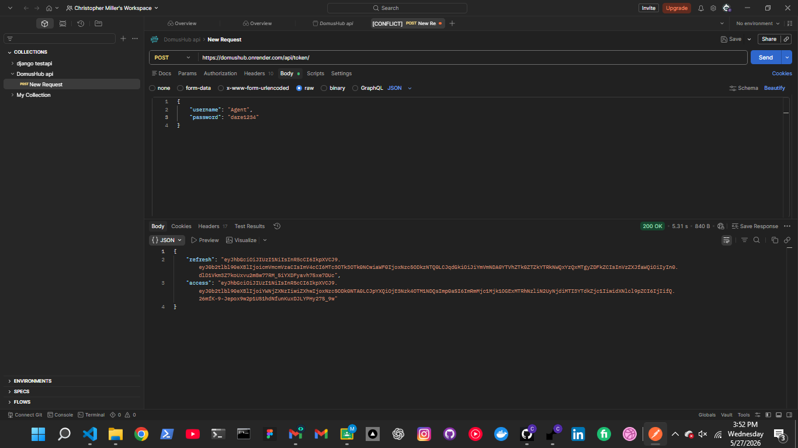
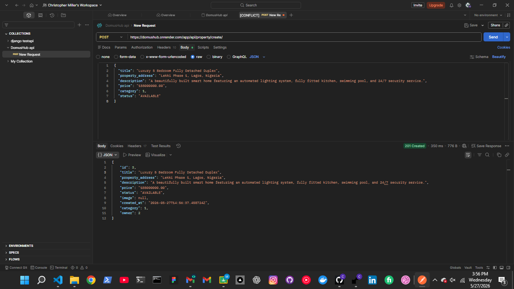
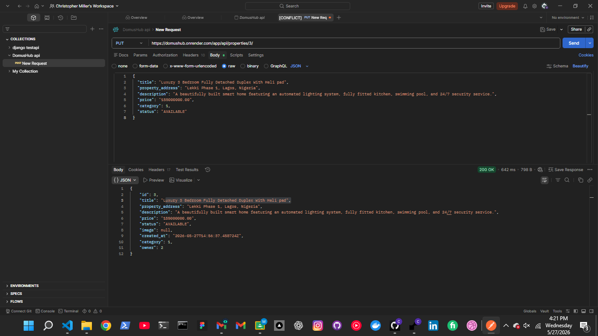
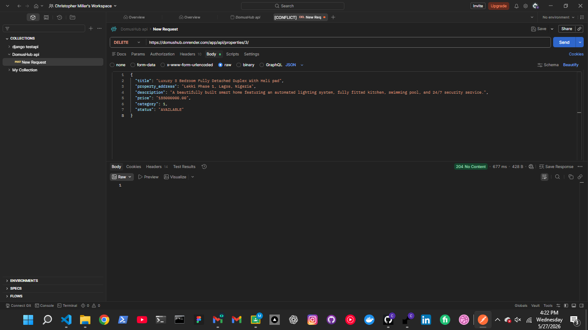
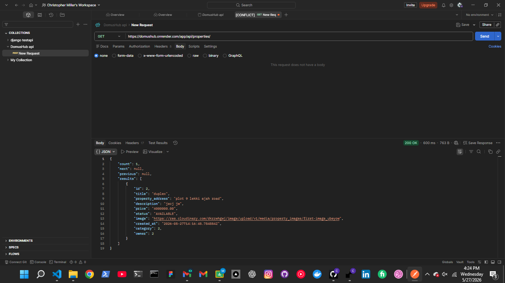

# DomusHub  — DomusHub
> **Dune Cohort Final Project**

DomusHub is a real estate web app built with Python and Django. It connects property buyers with estate agents. Verified agents can log into a dashboard to create, update, and delete their properties. Buyers can browse listings, search by keywords, add properties to a favorites list, and click a button to text the agent directly on WhatsApp.

### Live Link
🔗 **[https://domushub.onrender.com](https://domushub.onrender.com)**

---

##  Main Features

###  Accounts and Roles
*   **Two User Types:** Separate dashboards for standard users (individuals) and estate agents.
*   **Login and Validation:** Custom login forms that show error messages on screen if someone types a wrong password.
*   **API Security:** Protects endpoints using both JWT Tokens (SimpleJWT).

###  Agent Dashboard (`/app/agent/`)
*   **Property CRUD:** Agents can add new houses, view their active properties, edit details, or delete listings.
*   **Image Storage:** Handles property image uploads and connects directly to Cloudinary so uploaded files do not get wiped out on deployment.
### Individual User Dashboard (`/app/individual/`)
*   **Category Counters:** Automatically counts how many properties are inside each category on the home screen.

###  Search and WhatsApp Connect
*   **Multi-Field Search:** Users can search for words across names, physical addresses, or categories at the same time using Django `Q` objects.
*   **Favorites:** Users can save properties to a private list.
*   **WhatsApp Direct Link:** Cleans the agent's phone number, removes leading zeros, prefixes country codes (+234), and launches the WhatsApp app on mobile with a pre-written message.

---

##  Tech Stack
*   **Backend:** Python and Django 6.0.4
*   **APIs:** Django REST Framework (DRF)
*   **Database:** PostgreSQL (Hosted on Supabase)
*   **Media Storage:** Cloudinary CDN
*   **Static Files:** WhiteNoise Middleware
*   **Server Host:** Render

---

##  API Documentation
The API returns a paginated list of properties with a limit of 6 items per page.


| Method | URL Path | Auth Needed | Description |
| :--- | :--- | :--- | :--- |
| `POST` | `/api/token/` | No | Exchange username/password for an Access and Refresh JWT. |
| `POST` | `/api/token/refresh/` | No | Get a new Access token using a Refresh token. |
| `GET` | `/app/api/properties/` | No | Get a list of 6 properties. Supports search filters. |
| `POST` | `/app/api/properties/create/` | **Yes (JWT/Token)** | Lets logged-in agents post a new house programmatically only for agents. |
| `PUT` | `/app/api/properties/<id>/` | **Yes (JWT/Token)** | Lets logged-in agents edit their house programmatically only for agents. |
| `DELETE` | `/app/api/properties/<id>/` | **Yes (JWT/Token)** | Lets logged-in agents delete their house programmatically only for agents. |

### Example Response (`GET /app/api/properties/`)
```json
{
  "count": 18,
  "next": "https://onrender.com/api/properties/?page=2",
  "previous": null,
  "results": [
    {
      "id": 12,
      "title": "Duplex apartment",
      "property_address": "Plot 9 lekki ajah road",
      "description": "4 bedroom house with parking space.",
      "price": "4000000.00",
      "status": "AVAILABLE",
      "image": "https://cloudinary.com",
      "created_at": "2026-05-27T14:09:47Z",
      "category": 2,
      "owner": 4
    }
  ]
}
```

---

##  How to Set Up and Run Locally

Follow these steps to run the project on your local computer:

### 1. Clone the project
```bash
git clone https://github.com/maillermichael2-cell/dune-cohort-final-project
cd dune-cohort-final-project
```

### 2. Set up a virtual environment
```bash
# Windows
python -m venv env
.\env\Scripts\Activate.ps1

# Mac/Linux
python3 -m venv env
source env/bin/activate
```

### 3. Install packages
```bash
pip install -r requirements.txt
```

### 4. Create your environment variables
Create a `.env` file right next to `manage.py` and fill it with your keys using the example variables list below.

### 5. Run migrations and create admin
```bash
python manage.py makemigrations
python manage.py migrate
python manage.py createsuperuser
```

### 6. Start the server
```bash
python manage.py runserver
```
Go to **`http://127.0.0.1:8000`** in your browser.

---

##  Environment Variables (.env.example)
Create a file named `.env.example` and paste these exact variable names. Leave the values blank or use dummy text like below:

```text
SECRET_KEY=your_secret_django_key
DEBUG=True
ALLOWED_HOSTS=localhost,127.0.0.1
DATABASE_URL=sqlite:///db.sqlite3
CLOUDINARY_CLOUD_NAME=your_cloud_name
CLOUDINARY_API_KEY=your_api_key
CLOUDINARY_API_SECRET=your_api_secret
```

*   `SECRET_KEY`: Django's security token.
*   `DEBUG`: Set to `True` for development, `False` for production.
*   `DATABASE_URL`: Set to SQLite locally and your Supabase PostgreSQL url on Render.
*   `CLOUDINARY_*`: Your unique keys copied from the Cloudinary dashboard to handle image uploads.

---

##  Screenshots
*(All screenshots are saved inside the `screenshots/` folder in the project root).*
1. **User Home Page:** Displays all properties with search and category filters.
    
2. **Agent Dashboard:** Shows the agent's active listings with options to edit or delete
    
3. **Create Property Form:** A form for agents to add new properties with image upload.
    
4. **WhatsApp Connect:** A mobile screenshot showing the WhatsApp app opening with a pre-filled message to the agent.
    
## API SCREENSHOTS
1. **Unauthorized Access:** Screenshot of the API response when trying to get aproperty without a token all endpoints are protected.
    
2. **Token Obtain:** Screenshot of the API response when obtaining JWT tokens.
    
3. **Property Create:** Creates Properties on the api platform
    
4. **Property Edit:** Edit Property
    
5. **Property Delete:** Delete Property
    
6. **Property List:** Get a list of properties with pagination and search filters.
    


##  Future Updates
1.  **Map Integration:** Add GeoDjango to view house locations directly on Google Maps.
2.  **Payment Gateway:** Add Paystack or Flutterwave so users can pay booking fees on the site.
3.  **Live Chat:** Use Django Channels and WebSockets to let buyers text agents live inside the web app.
4. **Advance Ui and Ux:** Using react native , react and advance css styling to create the app view and site view